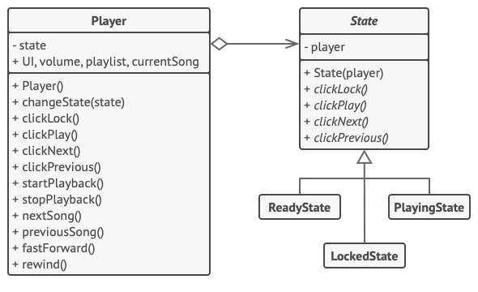
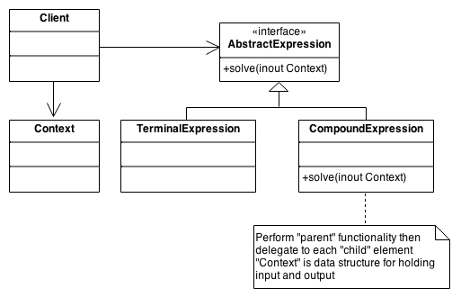

# Design Patterns with C#

- [Strategy Pattern](#strategy-pattern)
- [Chain of Responsibility](#chain-of-responsibility)
- [Template Pattern](#template-pattern)
- [Decorator Pattern](#decorator-pattern)
- [State Pattern](#state-pattern)
- [Builder Pattern](#builder-pattern)
- [Observer Pattern](#observer-pattern)
- [Factory Pattern](#factory-pattern)
- [FlyWeight Pattern](#flyweight-pattern)
- [Memento](#memento)
- [Interpreter](#interpreter)

## Strategy Pattern


<sup>Image by Refactoring Guru</sup>

The image above illustrates how this pattern works:

- The navigator class has a private member called `routeStrategy`, which is an interface.
- The interface declares a public method `buildRoute`.
- The classes `Road`, `PublicTransport` and `Walking` implement the interface `RouteStrategy`, where `buildRoute` follows their respective routing strategy.

The Strategy Pattern is useful when we have a group of similar algorithms and we need to alternate between them in different places of the application.

## Chain of Responsibility


<sup>Image by Refactoring Guru</sup>

The image above illustrates how this pattern works:

- There's a interface called `Handler` that contains two methods: `setNext` and `handle`. `setNext` sets which handler should be executed in case the requirements for the current handler aren't met. While `handle` is the action itself, that should validate if the request meets its requirements.
- `BaseHandler` is optional, it should implement boilerplate code for the concrete handlers such as calling the next handler or treating default exceptions.
- The `ConcreteHandlers` extend from `BaseHandler`, if it was implemented, or implement the `Handler` interface otherwise. According to Refactoring Guru:

> Each handler must decide whether to process it and, additionally, whether to pass it along the chain.

- The `Client` class exemplifies the use of the `ConcreteHandlers`, it instantiates three types of handlers and sets the chain accordingly. After that it calls the `handle` method from the first handler in the chain.

The Chain of Responsibility Pattern is useful when we have a sequence of possible actions that should be taken in case the request meets some criteria.

## Template Pattern


<sup>Image by Refactoring Guru</sup>

The image above illustrates how this pattern works:

- The `GameAI` abstract class has three implemented methods: `takeTurn`, `collectResources` and `attack`. These methods implementation are common between children classes, while the remaining methods implementation vary between them.
- Children classes `OrcsAI` and `MonstersAI` inherit `GameAI` and override the abstract methods according to their specific requirements.

The Template Pattern is useful when we have similar code structure in multiple classes and only some details change from code to code, that way avoiding code duplication.

## Decorator Pattern


<sup>Image by Refactoring Guru</sup>

The image above illustrates how this pattern works:

- There's a interface `Notifier` that contains a method that sends a message.
- An abstract class called `BaseDecorator` has as its member a wrappee, which is a notifier. This wrappee is set on the constructor. Also there's a method send, that calls the wrappee's send method.
- All three `SMSDecorator`, `FacebookDecorator` and `SlackDecorator` inherit the `BaseDecorator` class and override the send method to, besides calling the parent class send method, also calls its own send algorithm.
- Therefore, the client class only needs to stack which notifiers should be executed together, as the code below exemplifies

```csharp
var stack = new Notifier();

if(facebookEnabled)
{
    stack = new FacebookDecorator(stack);
}

if(slackEnabled)
{
    stack = new SlackDecorator(stack);
}

app.setNotifier(stack);
```

The Decorator Pattern is useful when we have behaviors that could be composed by behaviors from other classes involved in the same hierarchy.

## State Pattern



<sup>Image by Refactoring Guru</sup>

The image above illustrates how this pattern works:

- There's a `State` interface that contains a `player` property, a constructor that receives the `player` as a parameter, and four methods: `clickLock`, `clickPlay`, `clickNext` and `clickPrevious`. All these methods have different implementations for each player state, also each state should take care of the transitions between states.
- There are three possible states for the player: ready, playing and locked. Each of those has its own class that implements the `State` interface.
- The `Player` class controls the current state and other media player attributes like UI, volume, playlist and current song. Among the class methods are `clickLock`, `clickPlay`, `clickNext` and `clickPrevious`, which should call the current state implementation of that method.

The State Pattern is useful when we have a state machine. Usually, the management of transitions between states are complex, becoming harder to implement and maintain when the applications starts to scale. This pattern allows a smother management of those states and their transitions, since each state has its own class and controls the transition to the previous/next state in the flow.

## Builder Pattern


<sup>Image by Refactoring Guru</sup>

The image above illustrates how this pattern works:

- There's a `Builder` interface that determines how vehicle builder classes should implement.
- There are two builder classes `CarBuilder` and `CarManualBuilder`, both implement the `Builder` interface. Each one has an attribute relate to which entity they want to build, `Car` and `Manual`, respectively. Each method required by the interface should store how each of those should be built (number of seats, engine, trip computer and GPS). At last, both have a `getResult` method that returns the wanted entity with the attributes defined in the previous methods.

The State Pattern is useful when we have an object that is complex to create and/or with a lot of attributes.

## Observer Pattern


<sup>Image by Refactoring Guru</sup>

The image above illustrates how this pattern works:

- There's a `EventListeners` interface that contains a method to update a file name in a specific system
- There are two listener classes `EmailAlertsListener` and `LoggingListener`, both implement the `EventListeners` interface.
- There's an `EventManager`that has a list of listeners, which is responsible for subscribing, unsubscribing and notifying an event listener that they should execute their update method.
- At last, but not least, there's the `Editor` class that has an `EventManager`, that calls its notify method when the editor opens/saves a file.

The Observer Pattern is useful when we have a class that is growing on responsibilities, or when we have different actions to be executed after a specific process.

## Factory Pattern


<sup>Image by Refactoring Guru</sup>

The image above illustrates how this pattern works:

- There's a `Button` interface that contains two methods `render` and `onClick`.
- There are two button classes `WindowsButton` and `HTMLButton`, both implement the `Button` interface.
- There's a `Dialog` class that has two methods `render` and `createButton`. The `render` method creates a button, sets the `onClick` callback to close the dialog and then renders the button. While the `createButton` is an abstract method.
- `WindowsDialog` and `WebDialog` are children classes of `Dialog`, and each implement the `createButton` method, the former creates a `WindowsButton` and the latter, a `HTMLButton`.

The Factory Pattern is useful when we want to separate a process (in the example, the creation of a button) in a single place.

The difference between the factory and the builder patterns is that the builder pattern requires a lot of information to create an object, while the factory doesn't.

## FlyWeight Pattern


<sup>Image by Refactoring Guru</sup>

The image above illustrates how this pattern works:

- There's a `TreeType`, that contains the attributes `name`, `color` and `texture`, and a method `draw`.
- There's a `Tree` class that contains two attributes `x`, `y` (referring to its location in a forest) and `type`, and a method `draw`.
- There's a `TreeFactory` class that has a list of tree types, and a method to get a tree type based on its name, color and texture. If the factory finds an existing type, it returns the found type, otherwise it adds the new type to its list.
- There's a `Forest` class that contains a list of trees, and two methods `plantTree` and `draw`. `plantTree` first asks to the `TreeFactory` search for the tree type that is associated to the `name`, `color` and `texture` requested, then creates a new instance of `Tree` with the returned type, and, at last, adds it to the trees list.

The FlyWeight Pattern is useful when we want to save resources (memory or processing time, for example) by saving multiple instances of the same object in a factory. In the example above, we stored the tree types.

The difference between the factory and the flyweight patterns is that the factory pattern isolates the process of creation of a complex class instance in another class. While the flyweight focuses on storing instances of that class, and not necessarily creating its instance.

The flyweight pattern is also very similar to the **Singleton pattern**, with the difference that the singleton pattern only stores a single instance, that'll be used globally.

## Memento Pattern


<sup>Image by Refactoring Guru</sup>

The image above illustrates how this pattern works:

- There's a `Editor` class, that contains the attributes `text`, `cursorPos`, `selection`, `currentFont`, etc; and two methods: `makeSnapshot` and `restore`.
- The class `Snapshot`, that contains all the information of the editor at a particular moment in time. It implements the `Memento` interface that contains two methods: `getName` and `getSnapshotDate`.
- There's a `History` class that is responsible for storing the snapshots taken.
- There's a `Command` class that is responsible for triggering the creation of snapshots and their restoration through the `Editor` class methods. The restoration method restores the editor to the attributes stored in a snapshot that's in the history.

The Memento Pattern is useful when we want to frequently restore an object to a previous state.

> :warning: The Memento Pattern can take a lot of memory in execution, it's important to limit history storage to avoid problems.

## Interpreter Pattern



<sup>Image by Source Making</sup>

The image above illustrates how this pattern works:

- There's a `AbstractExpression` interface, that contains the methods `solve`, which should solve a context/expression.
- The class `TerminalExpression` implements the interface `AbstractExpression`, and it's `solve` method returns a value that does not depend upon other contexts/expressions, while `CompoundExpression` class `solve` method does `solve` other expressions/context to determine its final result.

The Interpreter Pattern is useful when we want to build a DSL or an application that needs to solve mathematical expressions.
