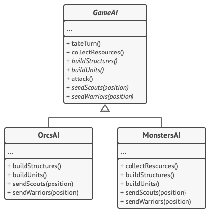
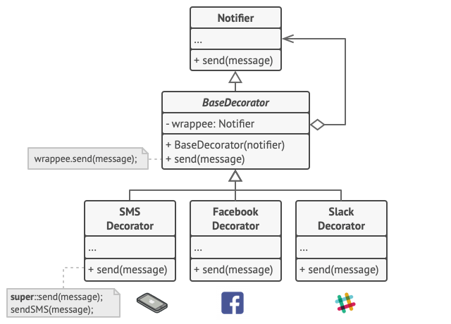

# Design Patterns with C#

- [Strategy Pattern](#strategy-pattern)
- [Chain of Responsibility](#chain-of-responsibility)
- [Template Pattern](#template-pattern)
- [Decorator Pattern](#decorator-pattern)

## Strategy Pattern


 <sup>Image by Refactoring Guru</sup>

The image above illustrates how this pattern works:

- The navigator class has a private member called `routeStrategy`, which is an interface.
- The interface declares a public method `buildRoute`.
- The classes `Road`, `PublicTransport` and `Walking` implement the interface `RouteStrategy`, where `buildRoute` follows their respective routing strategy. 

The Strategy Pattern is useful when we have a group of similar algorithms and we need to alternate between them in different places of the application.

## Chain of Responsibility


 <sup>Image by Refactoring Guru</sup>

 The image above illustrates how this pattern works:

- There's a interface called `Handler` that contains two methods: `setNext` and `handle`. `setNext` sets which handler should be executed in case the requirements for the current handler aren't met. While `handle` is the action itself, that should validate if the request meets its requirements. 
- `BaseHandler` is optional, it should implement boilerplate code for the concrete handlers such as calling the next handler or treating default exceptions.
- The `ConcreteHandlers` extend from `BaseHandler`, if it was implemented, or implement the `Handler` interface otherwise. According to Refactoring Guru:

> Each handler must decide whether to process it and, additionally, whether to pass it along the chain.

- The `Client` class exemplifies the use of the `ConcreteHandlers`, it instantiates three types of handlers and sets the chain accordingly. After that it calls the `handle` method from the first handler in the chain.


The Chain of Responsibility Pattern is useful when we have a sequence of possible actions that should be taken in case the request meets some criteria.

## Template Pattern



 <sup>Image by Refactoring Guru</sup>

The image above illustrates how this pattern works:

- The `GameAI` abstract class has three implemented methods: `takeTurn`, `collectResources` and `attack`. These methods implementation are common between children classes, while the remaining methods implementation vary between them.
- Children classes `OrcsAI` and `MonstersAI` inherit `GameAI` and override the abstract methods according to their specific requirements.

The Template Pattern is useful when we have similar code structure in multiple classes and only some details change from code to code, that way avoiding code duplication.

## Decorator Pattern



 <sup>Image by Refactoring Guru</sup>

The image above illustrates how this pattern works:

- There's a interface `Notifier` that contains a method that sends a message.
- An abstract class called `BaseDecorator` has as its member a wrappee, which is a notifier. This wrappee is set on the constructor. Also there's a method send, that calls the wrappee's send method.
- All three `SMSDecorator`, `FacebookDecorator` and `SlackDecorator` inherit the `BaseDecorator` class and override the send method to, besides calling the parent class send method, also calls its own send algorithm.
- Therefore, the client class only needs to stack which notifiers should be executed together, as the code below exemplifies

```csharp
var stack = new Notifier();

if(facebookEnabled) 
{
    stack = new FacebookDecorator(stack);
}

if(slackEnabled)
{
    stack = new SlackDecorator(stack);
}

app.setNotifier(stack);
```

The Decorator Pattern is useful when we have behaviors that could be composed by behaviors from other classes involved in the same hierarchy.