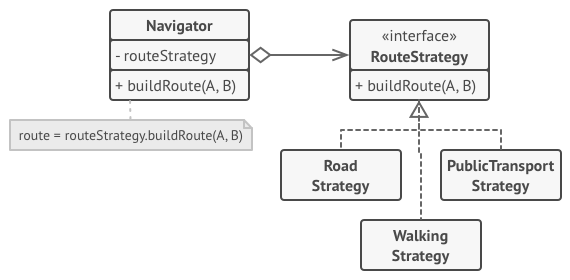

# Design Patterns with C#

- [Strategy Pattern](#strategy-pattern)

## Strategy Pattern

 Image by Refactoring Guru 

The image above illustrates how this pattern works:

- The navigator class has a private member called `routeStrategy`, which is an interface.
- The interface declares a public method `buildRoute`.
- The classes `Road`, `PublicTransport` and `Walking` implement the interface `RouteStrategy`, where `buildRoute` follows their respective strategy. 

The Strategy Pattern is useful when we have a group of similar algorithms and we need to alternate between them in different places of the application.